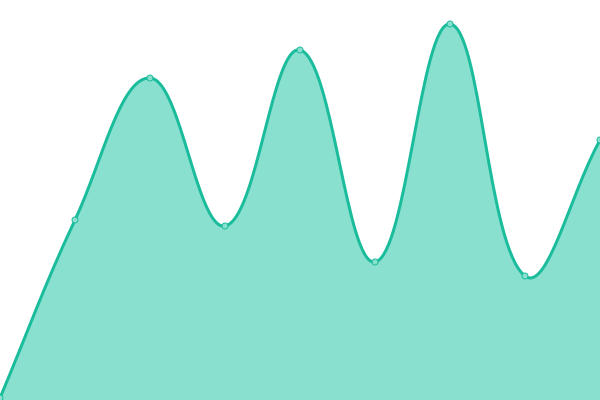
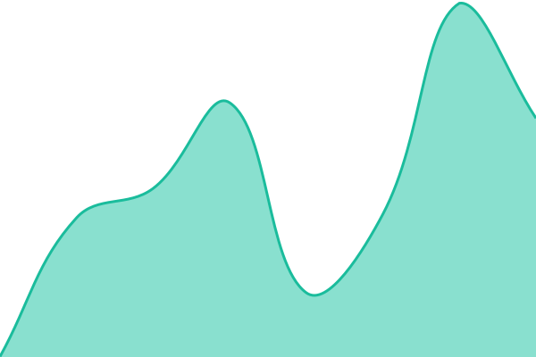
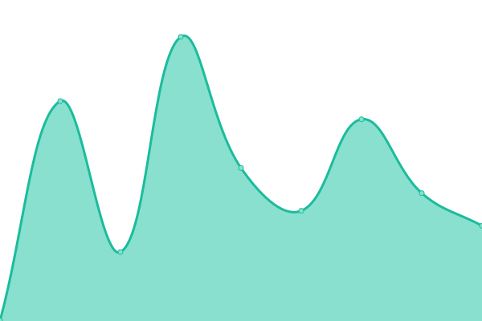
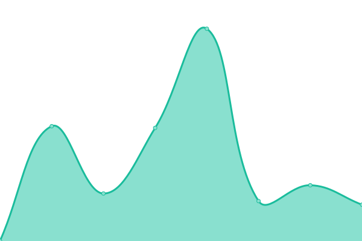

# [📈 Live Status](https://status.creepers.sbs): <!--live status--> **🟧 Partial outage**

This repository contains the open-source uptime monitor and status page for [creepers.sbs - Free Subdomains For Everyone](creepers.sbs), powered by [Upptime](https://github.com/upptime/upptime).

With [Upptime](https://upptime.js.org), you can get your own unlimited and free uptime monitor and status page, powered entirely by a GitHub repository. We use [Issues](https://github.com/creepersbs/status/issues) as incident reports, [Actions](https://github.com/creepersbs/status/actions) as uptime monitors, and [Pages](https://status.creepers.sbs) for the status page.

<!--start: status pages-->
<!-- This summary is generated by Upptime (https://github.com/upptime/upptime) -->
<!-- Do not edit this manually, your changes will be overwritten -->
<!-- prettier-ignore -->
| URL | Status | History | Response Time | Uptime |
| --- | ------ | ------- | ------------- | ------ |
|  [creepers.sbs](https://creepers.sbs) | 🟩 Up | [creepers-sbs.yml](https://github.com/creepersbs/status/commits/HEAD/history/creepers-sbs.yml) | 

 166ms
     
 | 

<a href="https://status.creepers.sbs/history/creepers-sbs">98.72%</a>
    

|  [creepers.cloud](https://creepers.cloud) | 🟩 Up | [creepers-cloud.yml](https://github.com/creepersbs/status/commits/HEAD/history/creepers-cloud.yml) | 

 133ms
     
 | 

<a href="https://status.creepers.sbs/history/creepers-cloud">100.00%</a>
    

|  [creepers.pro](https://creepers.pro) | 🟩 Up | [creepers-pro.yml](https://github.com/creepersbs/status/commits/HEAD/history/creepers-pro.yml) | 

 182ms
     
 | 

<a href="https://status.creepers.sbs/history/creepers-pro">100.00%</a>
    

|  [creepers.lol](https://creepers.lol) | 🟩 Up | [creepers-lol.yml](https://github.com/creepersbs/status/commits/HEAD/history/creepers-lol.yml) | 

 121ms
     
 | 

<a href="https://status.creepers.sbs/history/creepers-lol">100.00%</a>
    

|  [run-it.tech - 1 Year only, internal usage](https://run-it.tech) | 🟩 Up | [run-it-tech-1-year-only-internal-usage.yml](https://github.com/creepersbs/status/commits/HEAD/history/run-it-tech-1-year-only-internal-usage.yml) | 

 691ms
     
 | 

<a href="https://status.creepers.sbs/history/run-it-tech-1-year-only-internal-usage">98.72%</a>
    

|  [creepers.sbs - Docs](https://docs.creepers.sbs) | 🟩 Up | [creepers-sbs-docs.yml](https://github.com/creepersbs/status/commits/HEAD/history/creepers-sbs-docs.yml) | 

 374ms
     
 | 

<a href="https://status.creepers.sbs/history/creepers-sbs-docs">100.00%</a>
    

|  [creepers.sbs - Raw](https://raw.creepers.sbs) | 🟥 Down | [creepers-sbs-raw.yml](https://github.com/creepersbs/status/commits/HEAD/history/creepers-sbs-raw.yml) | 

 0ms
     
 | 

<a href="https://status.creepers.sbs/history/creepers-sbs-raw">0.00%</a>
    

|  [creepers.sbs - WhoIs](https://whois.creepers.sbs) | 🟥 Down | [creepers-sbs-who-is.yml](https://github.com/creepersbs/status/commits/HEAD/history/creepers-sbs-who-is.yml) | 

 0ms
     
 | 

<a href="https://status.creepers.sbs/history/creepers-sbs-who-is">0.00%</a>
    

|  [creepers.sbs - List](https://list.creepers.sbs) | 🟥 Down | [creepers-sbs-list.yml](https://github.com/creepersbs/status/commits/HEAD/history/creepers-sbs-list.yml) | 

 0ms
     
 | 

<a href="https://status.creepers.sbs/history/creepers-sbs-list">0.00%</a>
    

|  [creepers.sbs - Dashboard](https://dash.creepers.sbs) | 🟥 Down | [creepers-sbs-dashboard.yml](https://github.com/creepersbs/status/commits/HEAD/history/creepers-sbs-dashboard.yml) | 

 0ms
     
 | 

<a href="https://status.creepers.sbs/history/creepers-sbs-dashboard">0.00%</a>
    

|  [Lavalink Status - CreeperHUB](https://status.jukebox.creeperhub.net/) | 🟩 Up | [lavalink-status-creeper-hub.yml](https://github.com/creepersbs/status/commits/HEAD/history/lavalink-status-creeper-hub.yml) | 

 172ms
     
 | 

<a href="https://status.creepers.sbs/history/lavalink-status-creeper-hub">100.00%</a>
    

|  [Modmail Status - CreeperHUB](https://modmail.creeperhub.net) | 🟩 Up | [modmail-status-creeper-hub.yml](https://github.com/creepersbs/status/commits/HEAD/history/modmail-status-creeper-hub.yml) | 

 245ms
     
 | 

<a href="https://status.creepers.sbs/history/modmail-status-creeper-hub">100.00%</a>
    

|  [CreeperHUB](https://creeperhub.net) | 🟥 Down | [creeper-hub.yml](https://github.com/creepersbs/status/commits/HEAD/history/creeper-hub.yml) | 

 1683ms
     
 | 

<a href="https://status.creepers.sbs/history/creeper-hub">86.45%</a>
    

<!--end: status pages-->

[**Visit our status website →**](https://status.creepers.sbs)

## 📄 License

- Powered by: [Upptime](https://github.com/upptime/upptime)
- Code: [MIT](./LICENSE) © [Anand Chowdhary](https://anandchowdhary.com), supported by [Pabio](https://pabio.com)
- Data in the `./history` directory: [Open Database License](https://opendatacommons.org/licenses/odbl/1-0/)
